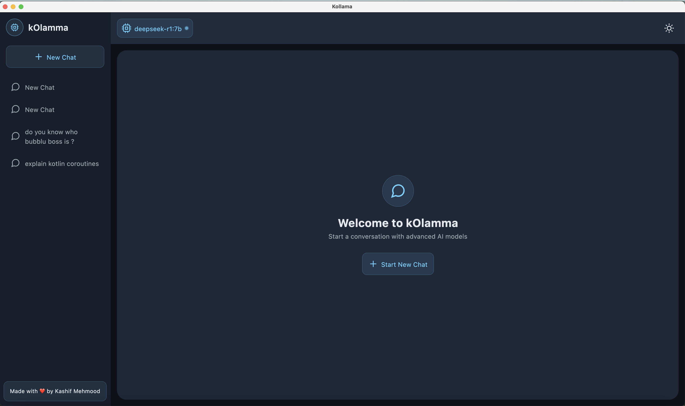
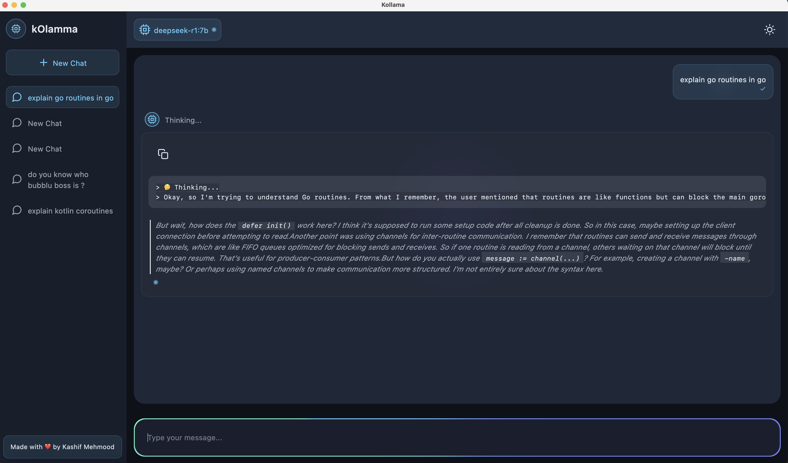
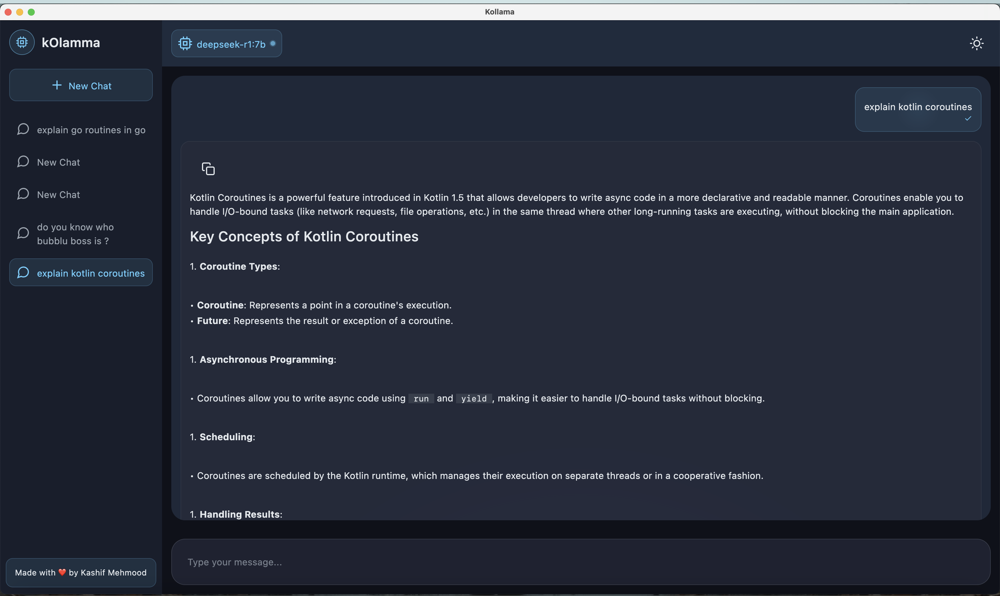

# Kollama

Kollama is a modern, desktop chat interface for Ollama models built with Kotlin and Jetpack Compose for Desktop. It provides a sleek, user-friendly way to interact with local AI models while offering advanced features like code formatting, markdown support, and animated UI elements.

## Features

- 🚀 **Modern Desktop UI**: Built with Compose for Desktop for a native, responsive experience
- 💬 **Real-time Chat Interface**: Smooth, chat-like interaction with AI models
- 🎨 **Rich Markdown Support**: Full markdown rendering including:
    - Syntax-highlighted code blocks
    - Tables
    - Lists and task lists
    - Blockquotes
    - Headers and formatting
- 🔄 **Advanced Message Handling**:
    - Real-time message streaming
    - Message retry functionality
    - Copy to clipboard support
    - Message status indicators
- 💾 **Persistent Storage**: Local SQLite database for chat history using Room
- 🎯 **Multiple Model Support**: Switch between different Ollama models seamlessly
- 🎭 **Dark/Light Theme**: Automatic theme switching with animated transitions
- ✨ **Polished UI Elements**:
    - Animated message borders
    - Pulsating status indicators
    - Smooth transitions and animations
    - Responsive layout


## Screenshots





## Prerequisites

- JDK 17 or higher
- Ollama installed and available in `/usr/local/bin/ollama`
- At least one Ollama model downloaded

## Getting Started

1. Install Ollama following the instructions at [Ollama's official website](https://ollama.ai)
2. Pull at least one model using Ollama CLI:
   ```bash
   ollama run deepseek-r1:1.5b
   ```
3. Clone this repository:
   ```bash
   git clone https://github.com/kashif-e/kollama.git
   ```
4. Build and run using Gradle:
   ```bash
   ./gradlew run
   ```

## Architecture

Kollama follows clean architecture principles and is organized into the following layers:

- **Presentation**: Compose UI components and ViewModels
- **Domain**: Business logic and model definitions
- **Data**: Repository implementations and local database
- **DI**: Dependency injection using Koin

### Key Components

- `ChatViewModel`: Manages chat state and user interactions
- `OllamaService`: Handles communication with Ollama models
- `ChatDatabase`: Local storage using Room
- `MarkdownFormatting`: Custom markdown processing and formatting

## Technical Features

### Database

- Room database for persistent storage
- Entities for chat sessions and messages
- Foreign key relationships for data integrity

### UI Components

- Custom composables for chat bubbles, model selection, and more
- Animated modifiers for enhanced visual feedback
- Markdown rendering with customizable typography

### State Management

- Kotlin Flow for reactive state updates
- ViewModel for UI state management
- Coroutines for asynchronous operations

## Development

### Project Structure

```
kollama/
├── data/
│   ├── local/
│   │   ├── dao/
│   │   └── database/
│   └── repository/
├── domain/
│   ├── model/
│   └── repository/
├── presentation/
│   ├── components/
│   ├── modifier/
│   ├── state/
│   └── theme/
└── di/
```

### Building

```bash
# Build the project
./gradlew build

# Run the application
./gradlew run

# Create distribution
./gradlew createDistribution
```

## Customization

### Model Configuration

Configure Ollama model settings in `OllamaService.kt`:

```kotlin
fun setGpuLayers(layers: Int)
fun setCudaDevices(devices: String)
fun setMaxRamUsage(ramMb: Int)
fun setMaxGpuMemory(memoryMb: Int)
```

### UI Customization

- Modify themes in `theme` package
- Customize markdown styles in `rememberMarkdownTypography`
- Adjust animations in `AnimatedModifier.kt`

## Contributing

1. Fork the repository
2. Create a feature branch
3. Commit your changes
4. Push to the branch
5. Create a Pull Request


## License

MIT License

Permission is hereby granted, free of charge, to any person obtaining a copy
of this software and associated documentation files (the \&quot;Software\&quot;), to deal
in the Software without restriction, including without limitation the rights
to use, copy, modify, merge, publish, distribute, sublicense, and/or sell
copies of the Software, and to permit persons to whom the Software is
furnished to do so, subject to the following conditions:

The above copyright notice and this permission notice shall be included in all
copies or substantial portions of the Software.

THE SOFTWARE IS PROVIDED \&quot;AS IS\&quot;, WITHOUT WARRANTY OF ANY KIND, EXPRESS OR
IMPLIED, INCLUDING BUT NOT LIMITED TO THE WARRANTIES OF MERCHANTABILITY,
FITNESS FOR A PARTICULAR PURPOSE AND NONINFRINGEMENT. IN NO EVENT SHALL THE
AUTHORS OR COPYRIGHT HOLDERS BE LIABLE FOR ANY CLAIM, DAMAGES OR OTHER
LIABILITY, WHETHER IN AN ACTION OF CONTRACT, TORT OR OTHERWISE, ARISING FROM,
OUT OF OR IN CONNECTION WITH THE SOFTWARE OR THE USE OR OTHER DEALINGS IN THE
SOFTWARE.

## Acknowledgments

- [Jetpack Compose for Desktop](https://www.jetbrains.com/lp/compose-desktop/)
- [Ollama](https://ollama.ai)
- [Room](https://developer.android.com/jetpack/androidx/releases/room)
- [Koin](https://insert-koin.io)