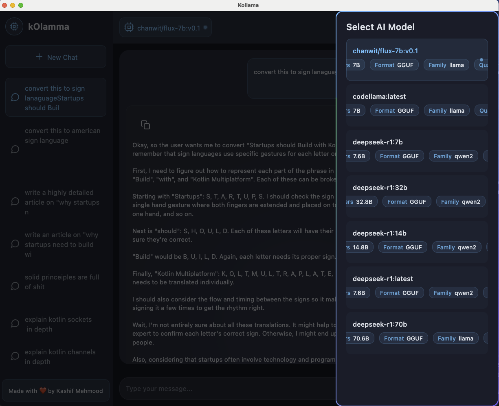

# Kollama

Kollama is a modern, cross-platform chat interface for Ollama models built with Kotlin Multiplatform and Compose Multiplatform. It provides a sleek, user-friendly way to interact with local AI models while offering advanced features like code formatting, markdown support, and animated UI elements.

## Features

- 🚀 **Cross-Platform Support**: Built with Kotlin Multiplatform and Compose Multiplatform
- 💬 **Real-time Chat Interface**:
  - Streaming responses with real-time updates
  - Concurrent chat support with efficient job management
  - Smart session handling with LRU cache
- 🎨 **Rich Markdown Support**:
  - Syntax-highlighted code blocks with customizable themes
  - Tables and complex formatting
  - Custom typography system
  - Optimized rendering for large messages
- 🔄 **Advanced Message Handling**:
  - Real-time message streaming with state management
  - Robust error handling and retry mechanism
  - Optimized clipboard operations
  - Sophisticated message state tracking
- 💾 **Persistent Storage**:
  - SQLDelight for efficient, type-safe SQL operations
  - Cross-platform database support
  - Optimized query performance
- 🎯 **Advanced Model Integration**:
  - Dynamic model switching with state preservation
  - Model details display with animated marquee
  - Real-time model status indicators
- 🎭 **Polished UI/UX**:
  - Animated right sheet with gesture support
  - Custom animated borders and transitions
  - Fluid dark/light theme switching
  - Responsive layout with efficient recomposition
  - Pulsating status indicators and loading states

## Screenshots




## Prerequisites

- JDK 17 or higher
- Ollama installed and running (default: localhost:11434)
- At least one Ollama model downloaded

## Getting Started

1. Install Ollama from [Ollama's official website](https://ollama.ai)
2. Pull a model using Ollama CLI:
   ```bash
   ollama pull deepseek-coder:33b
   ```
3. Clone this repository:
   ```bash
   git clone https://github.com/kashif-e/kollama.git
   ```
4. Run using Gradle:
   ```bash
   ./gradlew run
   ```

## Architecture

Kollama follows clean architecture principles with a focus on modularity and testability:

### Core Components

- **Presentation Layer**:
  - `ChatViewModel`: Manages UI state and user interactions
  - `ChatScreen`: Main UI composition
  - Custom composables for reusable UI elements
  - Advanced state management with Kotlin Flow

- **Domain Layer**:
  - Pure Kotlin models for type safety
  - Repository interfaces for data abstraction
  - Clear separation of concerns

- **Data Layer**:
  - `ChatRepository`: Implementation of data operations
  - `OllamaService`: Handles AI model communication
  - `DatabaseWrapper`: SQLDelight database operations
  - Efficient data mapping and transformation

- **Infrastructure**:
  - Koin for dependency injection
  - SQLDelight for database operations
  - Ktor for network communications

### Key Technical Features

#### State Management
```kotlin
data class ChatUiState(
    val isLoading: Boolean = false,
    val error: String? = null,
    val currentSession: ChatSessionDomainModel? = null,
    val chatSessions: List<ChatSessionDomainModel> = emptyList(),
    val selectedModel: OllamaModel? = null,
    val availableModels: List<OllamaModel> = emptyList(),
    val thinkingMessage: ChatMessageDomainModel? = null,
    val showModelList: Boolean = false,
)
```

#### Efficient Job Management
```kotlin
class ChatJobManager {
    private val mutex = Mutex()
    private val jobMap: MutableMap<String, JobState> = mutableMapOf()
    private val lruList = DoublyLinkedList<String>()
    
    // Manages concurrent chat sessions with LRU caching
}
```

#### Custom UI Components
```kotlin
@Composable
fun AnimatedBorderBox(
    borderColors: List<Color>,
    backgroundColor: Color,
    shape: Shape = RectangleShape,
    borderWidth: Dp = 1.dp,
    animationDurationInMillis: Int = 3000,
    content: @Composable BoxScope.() -> Unit
)
```

## Project Structure

```
kollama/
├── data/
│   ├── local/
│   │   ├── database/
│   │   └── service/
│   ├── model/
│   └── repository/
├── domain/
│   ├── interfaces/
│   └── model/
├── presentation/
│   ├── components/
│   ├── modifier/
│   ├── state/
│   └── theme/
└── di/
```

## Advanced Features

### Custom Animations
- Animated message borders with gradient effects
- Pulsating status indicators
- Smooth sheet transitions with gesture support
- Marquee animations for model details

### Performance Optimizations
- Efficient recomposition with remember/derivedStateOf
- Smart job management for concurrent chats
- Optimized database operations
- Proper coroutine scope management

### Network & Error Handling
- Robust error handling with custom error types
- Retry mechanisms for failed requests
- Proper timeout and cancellation handling
- Stream processing for real-time updates

## Contributing

1. Fork the repository
2. Create a feature branch
3. Commit your changes
4. Push to the branch
5. Create a Pull Request

## Acknowledgments

- [Kotlin Multiplatform](https://kotlinlang.org/docs/multiplatform.html)
- [Compose Multiplatform](https://www.jetbrains.com/lp/compose-multiplatform/)
- [Ollama](https://ollama.ai)
- [SQLDelight](https://cashapp.github.io/sqldelight/)
- [Koin](https://insert-koin.io)